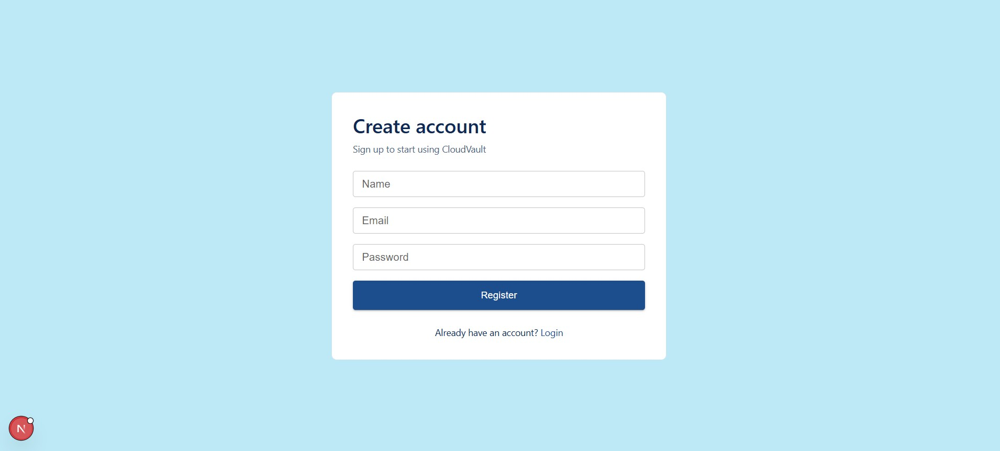
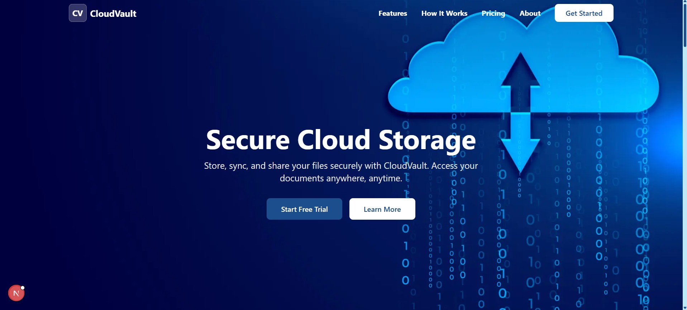
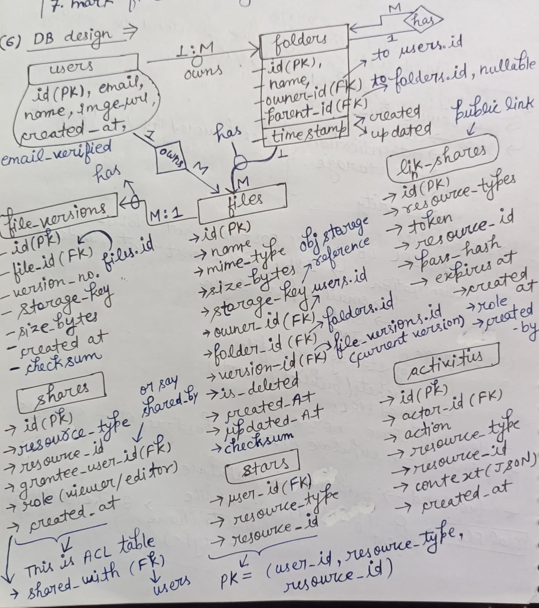
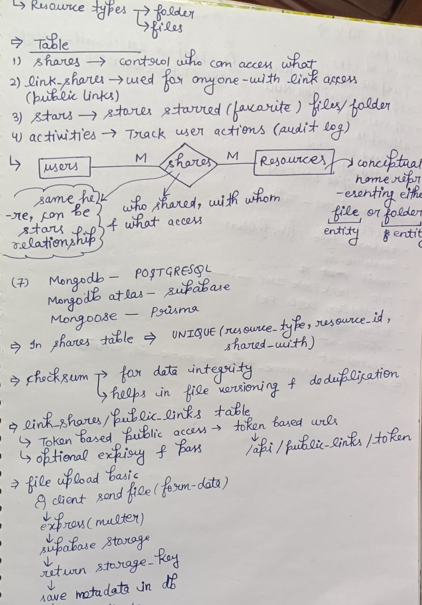
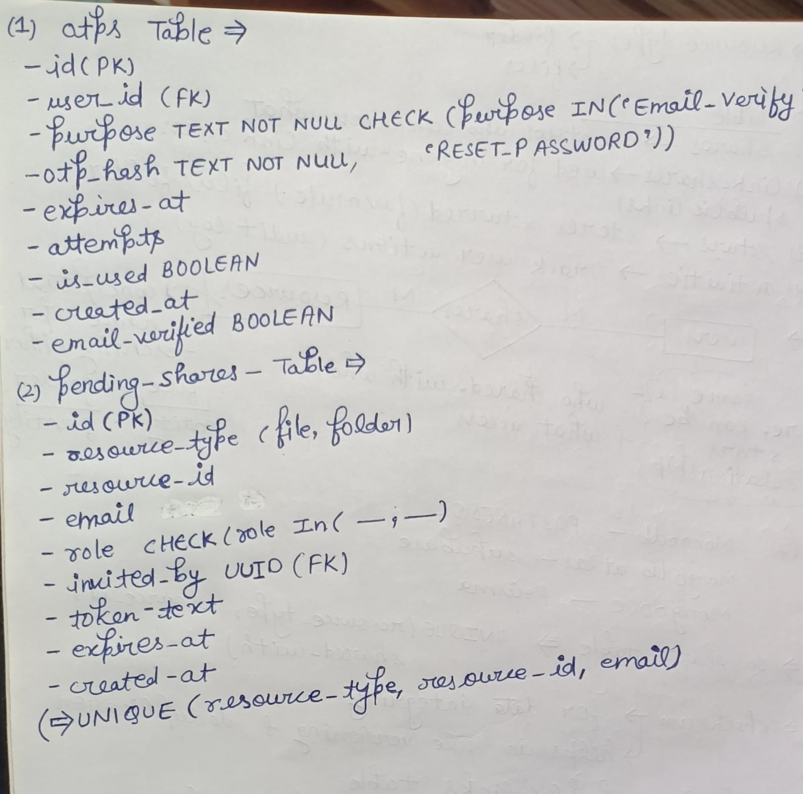

# CloudVault

> A modern, full-featured cloud storage platform with secure file management, sharing capabilities, and collaborative features.


##  Screenshots

### auth


### Landing Page


### Dashboard


### DB-1


### DB-2


### DB-3


##  Features

### Core Features

- **User Authentication**: Secure registration, login, and JWT-based sessions
- **File Management**: Upload, download, rename, and delete files
- **Folder Management**: Create, navigate, and organize folders hierarchically
- **File Sharing**: Share files/folders with specific users with role-based permissions
- **Search**: Full-text search across files and folders
- **Starred Items**: Mark favorites for quick access
- **Shared Resources**: Manage and access resources shared with you

### Advanced Features

- **Role-Based Access Control**: VIEWER, EDITOR, and OWNER permissions
- **Invite System**: Share via invite links with automatic account handling
- **Soft Delete**: Recover deleted files (with admin recovery option)
- **File Versioning**: Track file history and versions
- **Drag-and-Drop Upload**: Intuitive file upload interface
- **Progress Tracking**: Real-time upload/download progress
- **Responsive Design**: Works seamlessly on desktop, tablet, and mobile

##  Architecture

### Frontend Stack

- **Framework**: Next.js 16 with React 19
- **Styling**: Tailwind CSS 4 + Material-UI 7
- **State Management**: React Hooks + Context
- **HTTP Client**: Axios with automatic error handling
- **Form Handling**: react-hook-form
- **Notifications**: react-hot-toast

### Backend Stack

- **Runtime**: Node.js with Express.js 5.2
- **Database**: PostgreSQL 12+
- **Authentication**: JWT + Bcrypt
- **File Storage**: Supabase Storage (S3-compatible)
- **Email**: Nodemailer
- **File Upload**: Multer (50MB limit)

### Database

- PostgreSQL with soft-delete pattern
- Parameterized queries for security
- Optimized indexes for performance

##  Getting Started

### Prerequisites

- Node.js 16+ (LTS recommended)
- PostgreSQL 12+
- Git

### Installation

1. Clone the repository:

```bash
git clone https://github.com/yourusername/cloudvault.git
cd cloudvault
```

2. **Backend Setup**:

```bash
cd backend
npm install

# Create .env file with your configuration
# See .env.example for reference
nano .env

npm run dev
```

3. **Frontend Setup** (in new terminal):

```bash
cd frontend
npm install

# Create .env.local
echo "NEXT_PUBLIC_API_URL=http://localhost:4000/api" > .env.local

npm run dev
```

4. **Open in Browser**:

- Frontend: http://localhost:3000
- Backend API: http://localhost:4000

##  Environment Variables

### Backend (.env)

```
PORT=4000
NODE_ENV=development

# Database
DB_HOST=localhost
DB_PORT=5432
DB_NAME=cloudvault
DB_USER=postgres
DB_PASSWORD=your_password

# Supabase Storage
SUPABASE_URL=your_supabase_url
SUPABASE_KEY=your_supabase_key
SUPABASE_BUCKET=cloudvault

# Authentication
JWT_SECRET=your_super_secret_key_min_32_chars
JWT_EXPIRE=7d

# Email
EMAIL_SERVICE=gmail
EMAIL_USER=your_email@gmail.com
EMAIL_PASS=your_app_specific_password
```

### Frontend (.env.local)

```
NEXT_PUBLIC_API_URL=http://localhost:4000/api
```

##  API Documentation

### Authentication

```
POST   /api/auth/register          # Register new user
POST   /api/auth/login             # Login user
POST   /api/auth/logout            # Logout user
POST   /api/auth/forgot-password   # Request password reset
POST   /api/auth/reset-password    # Confirm password reset
POST   /api/auth/verify-email      # Verify email address
```

### Files

```
POST   /api/files/upload           # Upload file
GET    /api/files                  # List user's files
GET    /api/files/:id/download     # Download file
PATCH  /api/files/:id              # Rename file
DELETE /api/files/:id              # Delete file
GET    /api/files/:id/versions     # Get file versions
```

### Folders

```
POST   /api/folders                # Create folder
GET    /api/folders                # List folders
GET    /api/folders/:id            # Get folder contents
PATCH  /api/folders/:id            # Rename folder
DELETE /api/folders/:id            # Delete folder
```

### Sharing

```
POST   /api/shares                 # Create share
GET    /api/shares                 # Get user shares
DELETE /api/shares/:id             # Delete share
POST   /api/shares/accept/:token   # Accept share invite
GET    /api/shares/:token/details  # Get invite details
```

### Other

```
GET    /api/search                 # Search files/folders
POST   /api/stars                  # Star resource
DELETE /api/stars/:id              # Unstar resource
GET    /api/stars                  # Get starred items
```

##  Security Features

-  JWT-based authentication with expiry
-  Password hashing with bcrypt (12 rounds)
-  CORS configured and enforced
-  Role-based access control (RBAC)
-  SQL injection prevention (parameterized queries)
-  Email verification required
-  Secure file upload validation
-  Automatic logout on 401 errors

##  Database Schema

### Key Tables

- `users` - User accounts and authentication
- `files` - File metadata and ownership
- `folders` - Folder structure and hierarchy
- `shares` - User-to-user sharing relationships
- `stars` - Starred/favorite items
- `pending_shares` - Pending share invitations

All tables include:

- `created_at` - Record creation timestamp
- `updated_at` - Last modification timestamp
- `is_deleted` - Soft delete flag

##  Testing

### Run Tests

```bash
cd backend
npm test

cd frontend
npm test
```

### Manual Testing Checklist

See [TESTING_CHECKLIST.md](./TESTING_CHECKLIST.md) for comprehensive testing guide

### Test Coverage

-  13 features fully implemented
-  25+ API endpoints
-  30+ UI components
-  Full CRUD operations
-  Permission enforcement
-  Error handling

##  Deployment

### Production Build

```bash
# Frontend
cd frontend
npm run build

# Backend requires no build
cd backend
npm install --production
```

### Deployment Options

1. **Vercel** (Frontend recommended)
   - Connect GitHub repository
   - Set environment variables
   - Auto-deploy on push

2. **Heroku** (Backend)
   - Use PostgreSQL add-on
   - Configure Supabase storage
   - Set environment variables

3. **Docker** (Both)
   - See Dockerfile for containerization
   - Use docker-compose for local development

See [DEPLOYMENT_GUIDE.md](./DEPLOYMENT_GUIDE.md) for detailed instructions

##  Performance

- **Dashboard Load**: < 2 seconds
- **Search Debounce**: 300ms
- **File Upload**: Progress tracking in real-time
- **Database Queries**: Optimized with indexes
- **Frontend Bundle**: Optimized with Next.js

##  Known Issues

None currently identified. See [TEST_REPORT.md](./TEST_REPORT.md) for test results.

##  License
This project is licensed under the ISC License.

##  Contributing

1. Fork the repository
2. Create your feature branch (`git checkout -b feature/AmazingFeature`)
3. Commit your changes (`git commit -m 'Add some AmazingFeature'`)
4. Push to the branch (`git push origin feature/AmazingFeature`)
5. Open a Pull Request

##  Support

For support, email your-email@example.com or open an issue on GitHub.

##  Acknowledgments

- Material-UI team for excellent component library
- Next.js team for amazing framework
- Supabase for reliable storage solution
- Community contributors

---

**Last Updated**: January 21, 2026  
**Version**: 1.0.0
